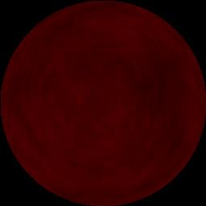
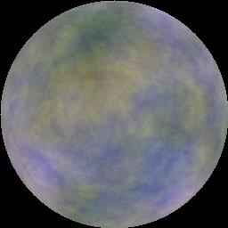

# GalactisFruit

## Description
A program that generates images of planets for space games. The planets are procedurally generated using astronomical rule sets.
The images are then rendered in real time using Perlin's Noise algorithm. 

## Last Updates: Galactis viewer 

I created a "library" that can be embedded in future projects. I then created a viewer that can run the library and accept parameter changes through a gui. This will help me prototype the correct color biomes and the look i am going for depending on the planet classes. 

## Starting Out
I wanted to start simple. So i built a console app around the perlin noise c# implementation available on github. I then added a couple helpr functions of my own.
I needed to publish an image to see how good the perlin noise generator was at making textures that resemlbled a planet. So i had the app spit out an image by walking
through a 2d array of perlin noise outputs and assigning it to an RGB color. The output needed to be scaled from 0-1 to 0-256.

I created a surface model using equations for a sphere. I then used the model to generate the 'z' position to place into the perlin noise generator.
Eventhough i got good results it wasn't appearing round enough.The key to making it look round was to mess with the 'z' of the perlin noise input. I had to multiply it by 200 ish times to get a roundness out of the noise.

## Initial Results
The results of the initial render was promising. I had to tweak the octaves and persistence variables to adjust the look and feel.

I created three surface models and just adjusted the noise a bit. I set each of the different surfaces to the R, G,B scales in the color code.

