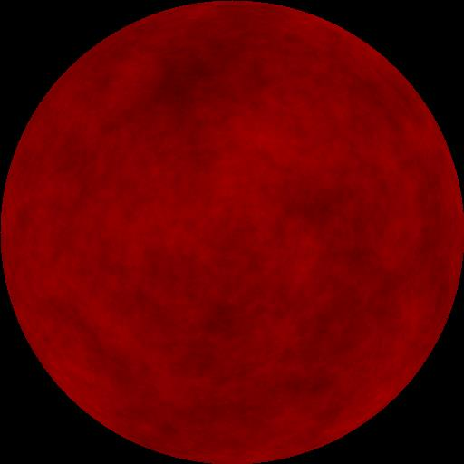

# GalactisFruit

## Description
A program that generates images of planets for space games. The planets are procedurally generated using astronomical rule sets.
The images are then rendered in real time using Perlin's Noise algorithm. 

## Starting Out
I wanted to start simple. So i built a console app around the perlin noise c# implementation available on github. I then added a couple helpr functions of my own.
I needed to publish an image to see how good the perlin noise generator was at making textures that resemlbled a planet. So i had the app spit out an image by walking
through a 2d array of perlin noise outputs and assigning it to an RGB color. The output needed to be scaled from 0-1 to 0-256.

I created a surface model using equations for a sphere. I then used the model to generate the 'z' position to place into the perlin noise generator.
Eventhough i got good results it wasn't appearing round enough.The key to making it look round was to mess with the 'z' of the perlin noise input. I had to multiply it by 200 ish times to get a roundness out of the noise.

Image Size of 256, Notice that the brightness is lower.

Image Size of 512, Notice that its much brighter.

I suspect that i have a conversion problem with my values into the 0-256 color code range. I am most likely not normalizing the values correctly so my brightness 
is adjusted because the range is not mapped correctly.
